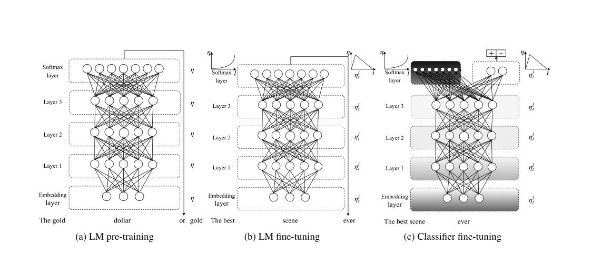
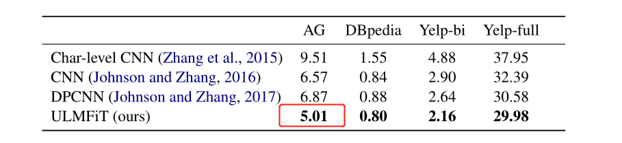

# Paddle-awdlstm

论文地址：[Universal Language Model Fine-tuning for Text Classification](https://arxiv.org/pdf/1801.06146v5.pdf)

**概述**：
归纳迁移学习已经极大地影响了计算机视觉，但现有的NLP方法仍然需要特定任务的修改和从零开始的训练。我们提出了通用语言模型微调(Universal Language Model Fine-tuning, ULMFiT)，这是一种有效的迁移学习方法，可以应用于自然语言处理中的任何任务，并介绍了语言模型微调的关键技术。在6个文本分类任务上，我们的方法显著优于目前最先进的方法，在大多数数据集上降低了18-24%的错误。

## 模型概述

    

## 原论文效果

    

